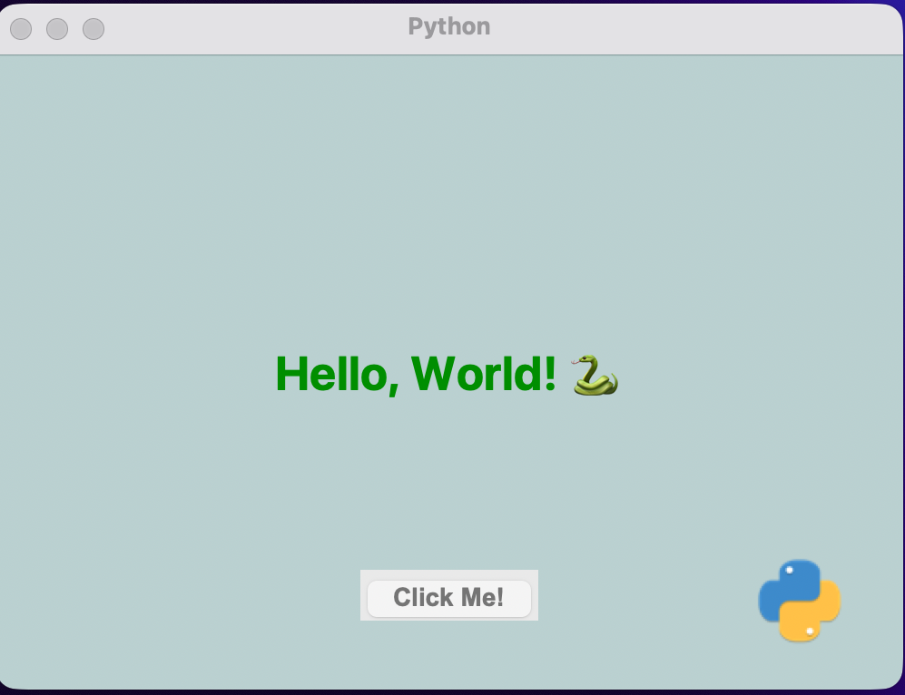

# 🐍 Python GUI Hello World
A minimal **Tkinter** GUI app built with Python that displays a simple “Hello, World!” message when you click the button.

---

## 📸 Preview

---

## ⚙️ Features
- Simple and clean graphical interface
- Made with Python's built-in **Tkinter** library
- Displays “Hello, World! 🐍” with one click

---

## 🚀 Run the project
1. Clone the repository  
   git clone https://github.com/POUYSF/Python-GUI-HelloWorld.git
2. Go inside the project folder  
   cd Python-GUI-HelloWorld
3. Run the app  
   python3 test.py

---

## 🧠 Requirements
- Python 3.x
- Pillow (`pip install pillow`)

---

## 📄 License
This project is licensed under the **MIT License**.